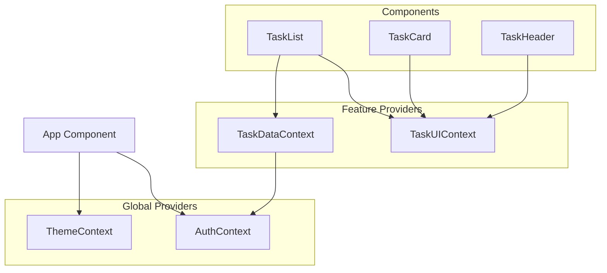

# Context Consolidation Analysis - Phase 3

## 🎯 Overview

This document provides a comprehensive analysis of current context usage patterns and evaluates opportunities for consolidation while maintaining performance, maintainability, and clear separation of concerns.

## 📊 Current Context Landscape

### **Existing Contexts**

| Context | Scope | Responsibilities | Size | Usage Frequency |
|---------|-------|------------------|------|-----------------|
| `TaskDataContext` | Feature | Data operations, pagination, server state | Medium | High |
| `TaskUIContext` | Feature | UI state, filters, mobile detection | Small | High |
| `AuthContext` | Global | Authentication, session management | Large | High |
| `ThemeContext` | Global | Theme management, persistence | Small | Medium |

### **Context Dependencies**



## 🔍 Current Usage Analysis

### **TaskDataContext Usage**
```typescript
// Current responsibilities:
interface TaskDataContextValue {
  // Server state
  tasks: Task[];
  isLoading: boolean;
  isFetching: boolean;
  error: Error | null;
  
  // Pagination state
  totalCount: number;
  currentPage: number;
  pageSize: number;
  hasNextPage: boolean;
  hasPreviousPage: boolean;
  
  // Pagination actions
  goToNextPage: () => void;
  goToPreviousPage: () => void;
}
```

**Components using TaskDataContext:**
- `TaskList` (full usage - pagination + data)
- Testing utilities

### **TaskUIContext Usage**
```typescript
// Current responsibilities:
interface TaskUIContextType {
  // Filter state
  filter: TaskFilter;
  setFilter: (filter: TaskFilter) => void;
  
  // Expansion state
  expandedTaskId: string | null;
  setExpandedTaskId: (id: string | null) => void;
  
  // Device detection
  isMobile: boolean;
}
```

**Components using TaskUIContext:**
- `TaskList` (filter only)
- `TaskCard` via `useTaskCard` hook (expansion only)
- `TaskDetails` (mobile detection only)
- `CountdownTimer` (mobile detection only)
- `TaskHeader` (unknown usage)

### **Co-location Patterns**

**High Co-location (used together):**
- `TaskList`: Uses both `TaskDataContext` and `TaskUIContext`

**Independent Usage:**
- Most components use only `TaskUIContext`
- Only `TaskList` needs both contexts

## 🎯 Consolidation Opportunities

### **Option 1: Full Consolidation (NOT RECOMMENDED)**

**Concept**: Merge TaskDataContext and TaskUIContext into single TaskContext

❌ **Reasons Against:**
- **Performance**: Would cause unnecessary re-renders when UI state changes
- **Separation of Concerns**: Mixes server state with client UI state
- **Testing**: More complex to mock and test
- **Maintainability**: Violates single responsibility principle

### **Option 2: Selective Consolidation (NOT RECOMMENDED)**

**Concept**: Move mobile detection to a global context or hook

❌ **Reasons Against:**
- **Coupling**: Would create unnecessary global dependency for feature-specific behavior
- **Performance**: Mobile detection is efficiently handled with local state
- **Scope**: Mobile detection is only used within task components

### **Option 3: Enhanced Composition (RECOMMENDED)**

**Concept**: Keep contexts separate but enhance the composition layer

✅ **Benefits:**
- **Maintains Performance**: Separate contexts prevent unnecessary re-renders
- **Clear Boundaries**: Server state vs. UI state separation preserved
- **Enhanced DX**: Better composition utilities and debugging tools
- **Future-Proof**: Easy to extend or modify individual contexts

## 🏗️ Recommended Approach: Enhanced Composition

### **Keep Current Context Separation**

**TaskDataContext**: ✅ **KEEP AS-IS**
- **Rationale**: Pure server state management
- **Performance**: Changes only when data updates
- **Scope**: Correctly scoped to data operations
- **Dependencies**: Appropriately depends on AuthContext

**TaskUIContext**: ✅ **KEEP AS-IS** 
- **Rationale**: Pure UI state management
- **Performance**: Optimized with useMemo for stable references
- **Scope**: Correctly scoped to UI concerns
- **Independence**: No external dependencies

### **Enhance Composition Layer**

Instead of consolidating contexts, enhance the `TaskProviders` composition:

```typescript
// Enhanced TaskProviders with better utilities
export function TaskProviders({ children }: TaskProvidersProps) {
  return (
    <TaskDataContextProvider>
      <TaskUIContextProvider>
        {children}
      </TaskUIContextProvider>
    </TaskDataContextProvider>
  );
}

// Add combined hook for components that need both contexts
export function useTaskContexts() {
  const dataContext = useTaskDataContext();
  const uiContext = useTaskUIContext();
  
  return {
    data: dataContext,
    ui: uiContext,
  };
}

// Add conditional hooks for optional context usage
export function useTaskDataContextOptional() {
  try {
    return useTaskDataContext();
  } catch {
    return null;
  }
}
```

## 📈 Performance Analysis

### **Current Performance Characteristics**

✅ **TaskDataContext:**
- Re-renders only on server state changes
- Efficient pagination with prefetching
- Proper dependency management with AuthContext

✅ **TaskUIContext:**
- Re-renders only on UI state changes
- Memoized values prevent unnecessary updates
- Efficient mobile detection with cleanup

✅ **Context Isolation:**
- UI changes don't trigger data re-renders
- Data changes don't trigger UI re-renders
- Optimal component update patterns

### **Consolidation Impact Analysis**

| Scenario | Current Behavior | After Consolidation | Performance Impact |
|----------|------------------|--------------------|--------------------|
| Filter Change | Only UI context re-renders | Combined context re-renders | ❌ **Degraded** |
| Data Loading | Only data context re-renders | Combined context re-renders | ❌ **Degraded** |
| Mobile Detection | Only UI context re-renders | Combined context re-renders | ❌ **Degraded** |
| Task Expansion | Only UI context re-renders | Combined context re-renders | ❌ **Degraded** |

## 🧪 Testing Impact Analysis

### **Current Testing Benefits**
- **Isolation**: Can test data and UI contexts independently
- **Mocking**: Easy to mock specific context concerns
- **Focused Tests**: Test only the context behavior being validated

### **Consolidation Testing Drawbacks**
- **Complex Mocks**: Would need to mock larger, more complex context objects
- **Test Coupling**: UI tests would need to account for data state
- **Reduced Granularity**: Harder to test specific context behaviors in isolation

## 🔮 Future Scalability

### **Current Architecture Scalability**
✅ **Excellent scalability prospects:**
- Easy to add new UI state without affecting data layer
- Easy to modify data operations without affecting UI
- Clear patterns for adding new feature contexts
- Composable provider architecture

### **Alternative Patterns for Future**

**If complexity grows, consider:**

1. **State Management Libraries**
   ```typescript
   // Zustand for complex client state
   const useTaskUIStore = create((set) => ({
     filter: 'all',
     setFilter: (filter) => set({ filter }),
     // ... other UI state
   }));
   ```

2. **Atomic State Management**
   ```typescript
   // Jotai for atomic state
   const filterAtom = atom<TaskFilter>('all');
   const expandedTaskAtom = atom<string | null>(null);
   ```

## 📋 Specific Optimization Opportunities

### **1. Enhanced Provider Composition**

```typescript
// Add provider validation and debugging
export function TaskProviders({ children, debug = false }: TaskProvidersProps) {
  return (
    <TaskDataContextProvider>
      <TaskUIContextProvider>
        {debug && <TaskProviderDebugger />}
        {children}
      </TaskUIContextProvider>
    </TaskDataContextProvider>
  );
}
```

### **2. Convenience Hooks**

```typescript
// For components using both contexts
export function useTaskContexts() {
  return {
    data: useTaskDataContext(),
    ui: useTaskUIContext(),
  };
}

// For filtering-specific operations
export function useTaskFiltering() {
  const { tasks } = useTaskDataContext();
  const { filter, setFilter } = useTaskUIContext();
  const filteredTasks = useFilteredTasks(tasks, filter);
  
  return { filteredTasks, filter, setFilter };
}
```

### **3. Provider Status Utilities**

```typescript
// Enhanced provider status checking
export function useTaskProviderStatus() {
  const [status, setStatus] = useState({
    hasDataContext: false,
    hasUIContext: false,
    isReady: false,
  });
  
  useEffect(() => {
    try {
      const dataContext = useTaskDataContext();
      const uiContext = useTaskUIContext();
      
      setStatus({
        hasDataContext: !!dataContext,
        hasUIContext: !!uiContext,
        isReady: !!dataContext && !!uiContext,
      });
    } catch {
      setStatus({
        hasDataContext: false,
        hasUIContext: false,
        isReady: false,
      });
    }
  }, []);
  
  return status;
}
```

## 🎯 Phase 3 Recommendations

### **Primary Recommendation: NO CONSOLIDATION**

✅ **Keep current context architecture because:**

1. **Performance Optimized**: Current separation prevents unnecessary re-renders
2. **Well-Architected**: Clear separation of concerns between server and UI state
3. **Maintainable**: Each context has single responsibility
4. **Testable**: Easy to test and mock independently
5. **Scalable**: Room for growth without architectural changes

### **Enhancement Recommendations**

Instead of consolidation, implement these enhancements:

1. **✅ Add Convenience Hooks**: `useTaskContexts()`, `useTaskFiltering()`
2. **✅ Enhance Provider Utilities**: Better debugging and status checking
3. **✅ Improve Documentation**: Update usage patterns and examples
4. **✅ Add Performance Monitoring**: Context re-render tracking utilities

### **Future Monitoring Points**

**Consider consolidation only if:**
- Context usage patterns significantly change
- Performance issues arise from provider nesting
- Component complexity increases dramatically
- New requirements break current separation model

## 📊 Final Assessment

| Criteria | Current Architecture | Potential Consolidation | Winner |
|----------|---------------------|------------------------|---------|
| **Performance** | ✅ Optimized | ❌ Degraded | Current |
| **Maintainability** | ✅ Clear separation | ❌ Mixed concerns | Current |
| **Testability** | ✅ Isolated testing | ❌ Complex mocking | Current |
| **Developer Experience** | ✅ Clear patterns | ❌ Larger API surface | Current |
| **Scalability** | ✅ Room for growth | ❌ Harder to extend | Current |

---

## 🎉 Phase 3 Conclusion

**RECOMMENDATION**: **NO CONSOLIDATION NEEDED**

The current context architecture is well-designed, performant, and maintainable. Instead of consolidation, we should enhance the composition layer with convenience utilities while preserving the excellent separation of concerns that currently exists.

**Next Steps**: Implement enhanced provider utilities and convenience hooks to improve developer experience without compromising the solid architectural foundation. 